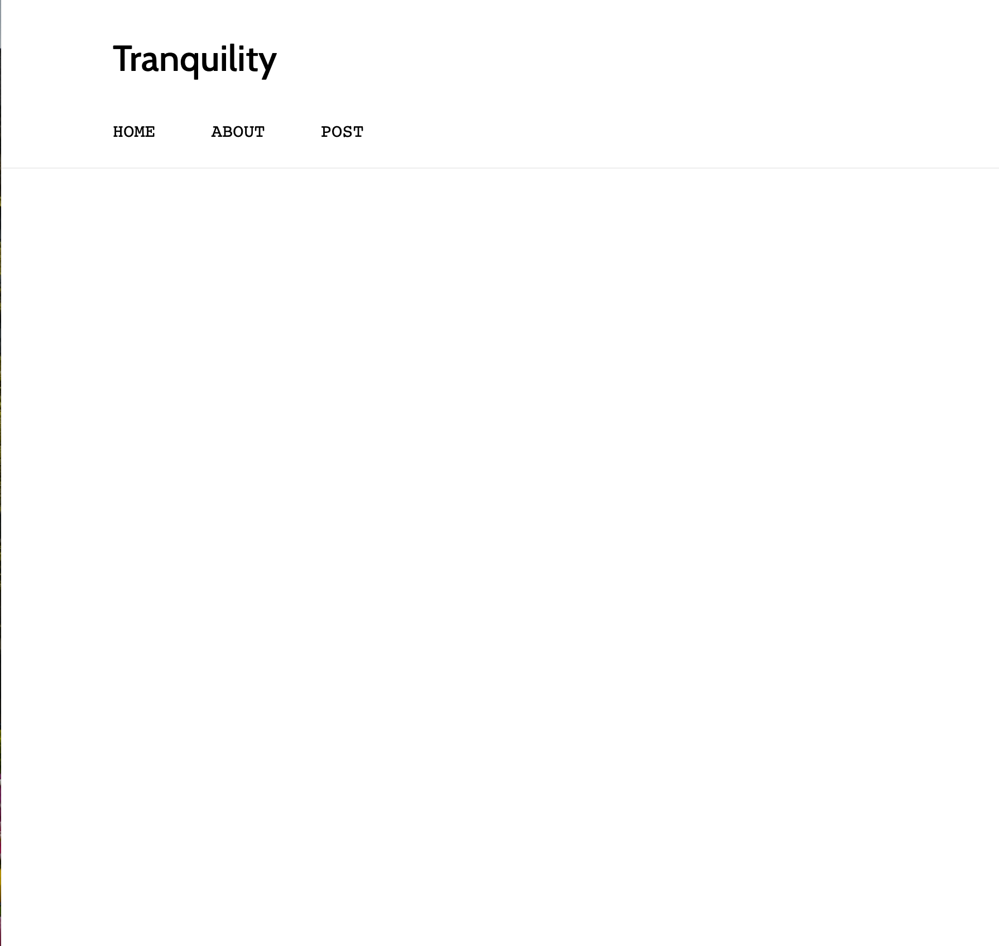

# Blog

This problem focuses on Vue and using a REST API.

## Overview of the Application

The blog app is a simple application for displaying a blog.

The back end is written for you, using Express and Mongoose. To
set up the back end:

```
cd back-end
npm install
node server.js
```

The front end is only partially written, using Vue CLI. To set up the front end:

```
cd front-end
npm install
npm run serve
```

You can visit the app in your browser at `localhost:8080`.

When you start up the application, it should look like this:



## Database Schema and Model

The database has one model, Blog, whose schema consists of:

- author: a string, the author of the blog article
- title: a string, the title of the blog article
- photo: a string, the path of a photo for the blog article
- blurb: a short blurb to introduce the blog article
- entry a string, the body of the blog article
- created: a date, the date the article was created

The date is automatically set to the current date when the article is created.

## REST API

The REST API implemented by the server consists of the following:

- GET /api/entries
  - gets all blog entries, sorted by reverse order of when they were created


- GET /api/entries/:id
  - gets a particular blog entry, identified by the supplied :id


- POST /api/entries
  - creates a new blog entry
  - the body must use formData and must contain an author, title, photo, blurb, and entry

## Tasks

Build the front end for the about page, post page, home page, and a page to view a single blog post. Each page should be a separate view. You may use a [Lorem Ipsum](https://www.lipsum.com/) generator for large chunks of text. The titles, blurbs, and photos should be meaningful.

- The about page should say something about the purpose of the blog and the blog author. Be creative.

- The post page should display a form that can be used to create new blog
  entries. The form should include all necessary information (except the date it
  was created, which is filled in automatically by the server). The form should
  be cleared when a new blog entry is successfully created and a short message
  displayed indicating it was successful. You should leave the form on the page at
  all times.

- The home page should display the current blog entries, including author,
  title, photo, blurb, and date created (not the entry). Use the `moment.js` library to
  format the date, like we have done with labs.

- The single view page should display a single blog entry, including author, title, photo, entry, and date created (not the blurb). You should be able to click on any part of a post from the home page (the image, title, blurb, etc) to get to the single page view. The single page view should *not* be in the menu.

- All pages should have reasonably good styling, following the web design
  guidelines discussed in class. You do not need to use responsive styles. You do not need to style the brand or menu, which are already done.

## Grading

This problem is worth 75 points. Grading will be based on this rubric:

| Item | Points  |
| ---------- | -------------------------------------------------------- |
| About Page | 10 |
| Post Page  | 20 |
| Home Page  | 20 |
| Single Page | 20 |
| Design     | 5 points (full points for average, zero points for poor) |

Partial Credit for each main part: 50% if solid effort but not close to working, 80%
if solid effort and close to working.

Style is graded based on:

* white space
* visual hierarchy
* navigation
* color
* typography

You can review [the web design principles](http://web-design.chiamo.org/) to get an idea of what I'm looking for.
