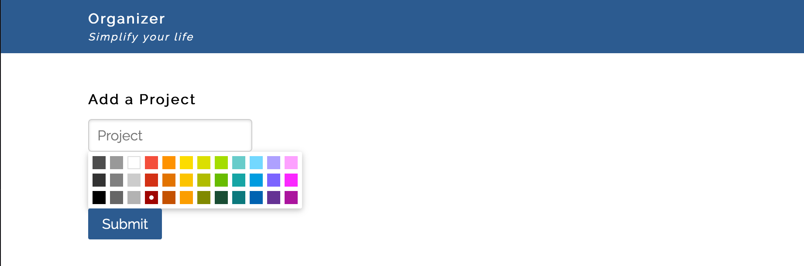
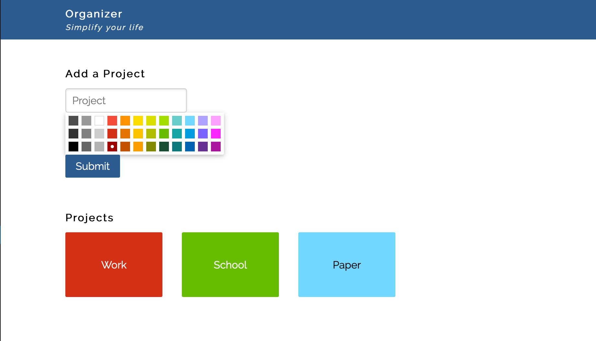
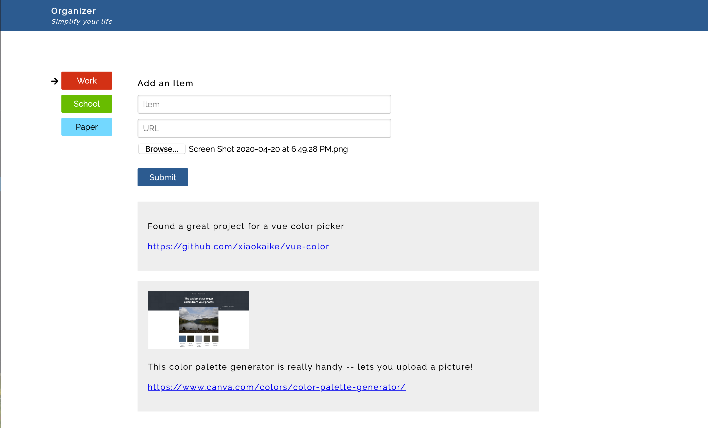

# Organizer

This problem focuses on using Node, Express, and Mongo to create a REST API.

## Overview of the Application


This directory contains a small application for organizing information for a variety of projects.
To run this code, you will need to do
the following:

```
cd front-end
npm install
npm run serve
```

This will run the Vue CLI app, which you can visit at `localhost:8080`.
When you start up the application, it should look like this;



The organizer is designed to store a loose collection of information organized by project. After your back end is written and you add some projects, it could look like this:



If you click on a project, you can add items. These are loosely structured in the sense that only one of the fields is required:



You do **not** need to write any front end code. All your code should be on the back end.

## Database Schema and Models

You will write the back end for this project. The database should consist of two models -- project and item.

The project documents store three strings: text, color, and textColor. The first is the name of the project, the second is the background color it uses, and the third is the text color.

The item documents store three strings as well: text, photo, and url. The text is any text. The photo is the path to a photo. The url is a link. The model for an item must reference the project the item belongs to, so that the server can find the items belonging to a particular project.n

## REST API

The REST API that the server should implement consists of the following:

- GET /api/project
  - gets all projects


- GET /api/project/:id
  - gets a particular project identified with :id


- POST /api/project
  - creates a new project
  - the body must contain "text", "color", and "textColor"


- GET /api/project/:id/items
  - get all of the items associated with a project


- POST /api/project/:id/items
  - create a new item associated with the project identified by the :id
  - the body must contain either "text", "url", or "photo". The "photo" is a file that should be uploaded with multer.
  - the body needs to use FormData() since it includes a file being uploaded


## Tasks

Build the database schemas and models, as well as the REST API, in `server.js`. You may factor this into separate modules if you wish.

- The database MUST be called `organizer`. This will make grading much easier.

- The schemas and models should work as defined above.

- The REST API should work as defined above.

- Start with getting and creating projects.

- Next work on getting and creating items.

- Be sure to include error checking on each POST request -- if any required part
  of the body is empty, then a 400 error should be returned. Errors must have
  a "message" property that explains the error. Examples of how to do this are
  in Lab 5.

- All endpoints should return a 500 error if an unexpected error occurs and log
  this error to the console.

- See the main README for screenshots required.

You should not modify the front end code in any way.

## Grading

This problem is worth 75 points. Grading will be based on this rubric:

| Item | Points |
| -------- | --------- |
| Viewing and adding projects | 30 points |
| Viewing and adding items    | 40 points |
| Error Checking (add project, add item) | 5 points  |

Partial Credit for each part: 50% if solid effort but not close to working, 80%
if solid effort and close to working.
